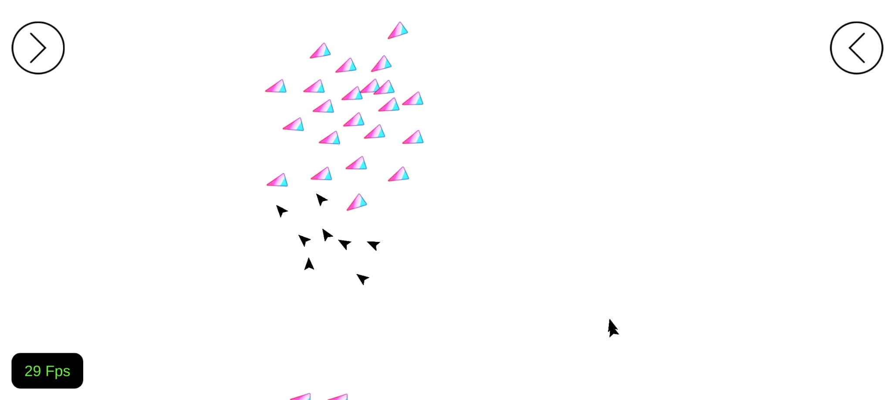
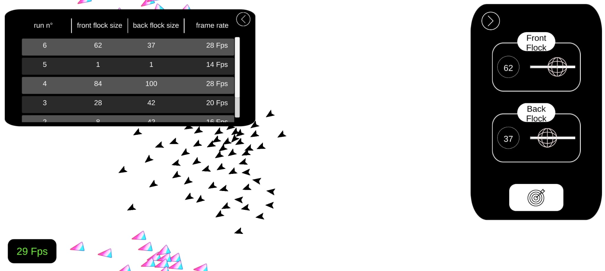

# Unity Flocking System

- [English](#english)
- [Português](#português)

---

## English

### Unity Flocking System (2018)

A Unity project implementing a **flocking system** (boids-style behaviour) for groups of agents (e.g. birds). The simulation runs in real time with a teal-themed debug/control UI overlay.

#### Features

- **Flocking behaviour**: Multiple groups of agents following cohesion, separation, and alignment rules.
- **Teal UI overlay**: The scene displays an on-screen panel with:
  - **FPS counter**: Current frame rate.
  - **Flock groups counter**: Number of active flock groups.
  - **Two buttons**: Each opens a different tab.
- **Tab 1 — Iterations table**: A table showing flock iteration data with columns for:
  - Back quantity
  - Flock format
  - Frame rate
- **Tab 2 — Flock controls**: Two sliders to adjust:
  - Front flock quantity
  - Back flock quantity

#### Screenshots

- **Figure 1.1**: Teal UI with FPS counter, flock groups counter, and the two tab buttons.

  

- **Figure 1.2**: One of the tabs (iterations table or flock sliders) open.

  

#### Tech

- **Unity** (2018)
- **C#**

---

## Português

### Unity Flocking System (2018)

Projeto em Unity que implementa um **sistema de flocking** (comportamento estilo boids) para grupos de agentes (ex.: pássaros). A simulação roda em tempo real com uma interface de debug/controle em tema teal.

#### Funcionalidades

- **Comportamento de flocking**: Múltiplos grupos de agentes com regras de coesão, separação e alinhamento.
- **UI teal**: A cena exibe um painel na tela com:
  - **Contador de FPS**: Taxa de quadros atual.
  - **Contador de grupos de flock**: Número de grupos de flock ativos.
  - **Dois botões**: Cada um abre uma aba diferente.
- **Aba 1 — Tabela de iterações**: Tabela com dados das iterações dos flocks (quantidade back, formato do flock, frame rate).
- **Aba 2 — Controles de flock**: Dois sliders para ajustar a quantidade do flock da frente e do fundo.

#### Capturas de tela

- **Figura 1.1**: UI teal com contador de FPS, contador de grupos de flock e os dois botões das abas.

  

- **Figura 1.2**: Uma das abas aberta (tabela de iterações ou sliders de flock).

  

#### Tecnologias

- **Unity** (2018)
- **C#**
